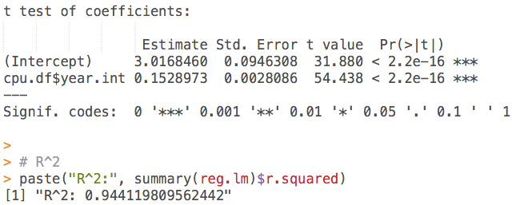

[](http://quantlet.de/index.php?p=info)

## [](http://quantlet.de/) **CMBcpureg** [](http://quantlet.de/d3/ia)

```yaml

Name of QuantLet : CMBcpureg

Published in : Computing Machines

Description : 'Calculates parameters of log-linear regression between transistor count and year of
introduction. HC3 standard errors are used. The R^2 value is also provided.'

Keywords : 'time-series, regression, R-squared, testing, data adjustment, empirical, estimation,
heteroskedasticity, logarithmic, lognormal, model, parameter, preprocessing, test, data, data set'

See also : 'MVAregbank, SFEtail, MVAbankrupt, BCS_Linreg, SFElognormal, CMBcpuscrap, CMBcpuregp,
CMBhddscrap, CMBhddreg, CMBhddregp, CMBbubbles'

Author : Torsten van den Berg, Sophie Burgard

Submitted : Thu, Jul 14 2016 by Torsten van den Berg

```




### R Code:
```r
# clear variables and close windows
rm(list = ls(all = TRUE))
graphics.off()

# set working directory
setwd("")

# install and load packages
packages = c("lmtest", "sandwich")
invisible(lapply(packages, function(pkg) {
    if (!is.element(pkg, installed.packages())) install.packages(pkg)
    library(pkg, character.only = TRUE)
}))

# read data
cpu.df = read.csv2("cpu.csv")

# new column with year as integer
cpu.df$year.int = cpu.df$Date - min(cpu.df$Date)

# regression
reg.lm  = lm(log10(cpu.df$Transistors) ~ cpu.df$year.int)

# coefficients
coeftest(reg.lm, vcov. = vcovHC)

# R^2
paste("R^2:", summary(reg.lm)$r.squared)

saveRDS(list(reg.lm = reg.lm, cpu.df = cpu.df), "cpureg.rds")

```
