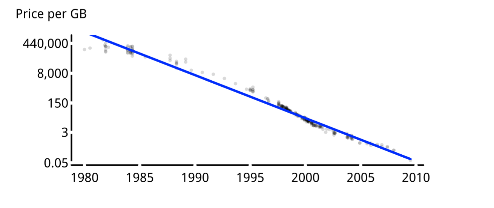

[](http://quantlet.de/index.php?p=info)

## [](http://quantlet.de/) **CMBhddregp** [](http://quantlet.de/d3/ia)

```yaml

Name of QuantLet : CMBhddregp

Published in : Computing Machines

Description : 'Plots results of regression with price per gigabyte of storage space as dependent
variable (CMBhddregp). Observations are plotted as scatter and regression results are represented
as blue line. The plot axes are customized.'

Keywords : 'time-series, regression, plot, graphical representation, visualization, data
visualization'

See also : CMBhddreg, MVAregbank, SFEtail, MVAbankrupt, BCS_Linreg, SFElognormal

Author : Torsten van den Berg, Sophie Burgard

Submitted : Wed, May 25 2016 by Torsten van den Berg

Datafile : hddreg.rds

```




### R Code:
```r
# clear variables and close windows
rm(list = ls(all = TRUE))
graphics.off()

# set working directory
setwd("")
options(stringsAsFactors = FALSE)

hdd.l  = readRDS("hddreg.rds")
reg.lm = hdd.l$reg.lm
hdd.df = hdd.l$hdd.df

#pdf("CMBhddregp.pdf", width = 6.5, height = 2.8)

par(mar = c(3, 4.8, 2.5, 4.8))

plot(hdd.df$date, 
     log(hdd.df$per.GB),
     pch  = 16,
     cex  = 0.6,
     col  = adjustcolor("black", alpha.f = 0.15),
     bty  = 'l',
     xaxt = "n",
     yaxt = "n",
     xlab = "",
     ylab = "")

lines(hdd.df$date, 
      predict(reg.lm),
      lwd = 3, 
      lty = 1,
      col = "blue")

box(lwd = 2, 
    bty = 'l', 
    col = "black")

mtext("Price per GB", 
      side = 3,
      line = 0.9, 
      cex  = 1, 
      col  = "black",
      adj  = -0.2)

# axis Labels ticks
x.lab  = c("1980-01-01", "1985-01-01", "1990-01-01", "1995-01-01", "2000-01-01",
           "2005-01-01", "2010-01-01")
x.lab2 = c("1980", "1985", "1990", "1995", "2000", "2005", "2010")
x.at   = as.Date(x.lab, "%Y-%m-%d")

axis(side     = 1,
     at       = x.at,
     labels   = x.lab2,
     tick     = FALSE, 
     cex.lab  = 0.8, 
     line     = -0.7, 
     col.axis = "black")

y.lab  = c(0.05,  3,  150,  8000,  440000)
y.lab2 = c("0.05",  "3",  "150",  "8,000",  "440,000")
y.at   = log(y.lab)

axis(side     = 2, 
     at       = y.at,
     labels   = y.lab2,
     tick     = FALSE, 
     cex.lab  = 0.8, 
     line     = -0.8, 
     col.axis = "black",
     las      = 1)

usr  = par("usr")
segments(x.at, 
         usr[3], 
         x.at,
         usr[3] - ((usr[4] - usr[3]) * 0.005), 
         lwd = 4, 
         col = "white", 
         xpd = TRUE)

segments(usr[1]+10, 
         y.at,
         usr[1] - ((usr[2] - usr[1]) * 0.005), 
         y.at,
         lwd = 4, 
         col = "white", 
         xpd = TRUE)

#dev.off()


```
