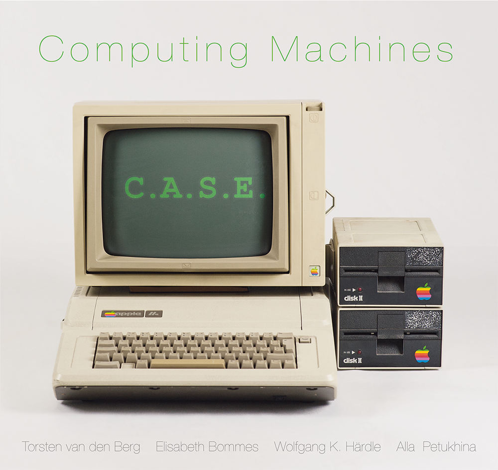
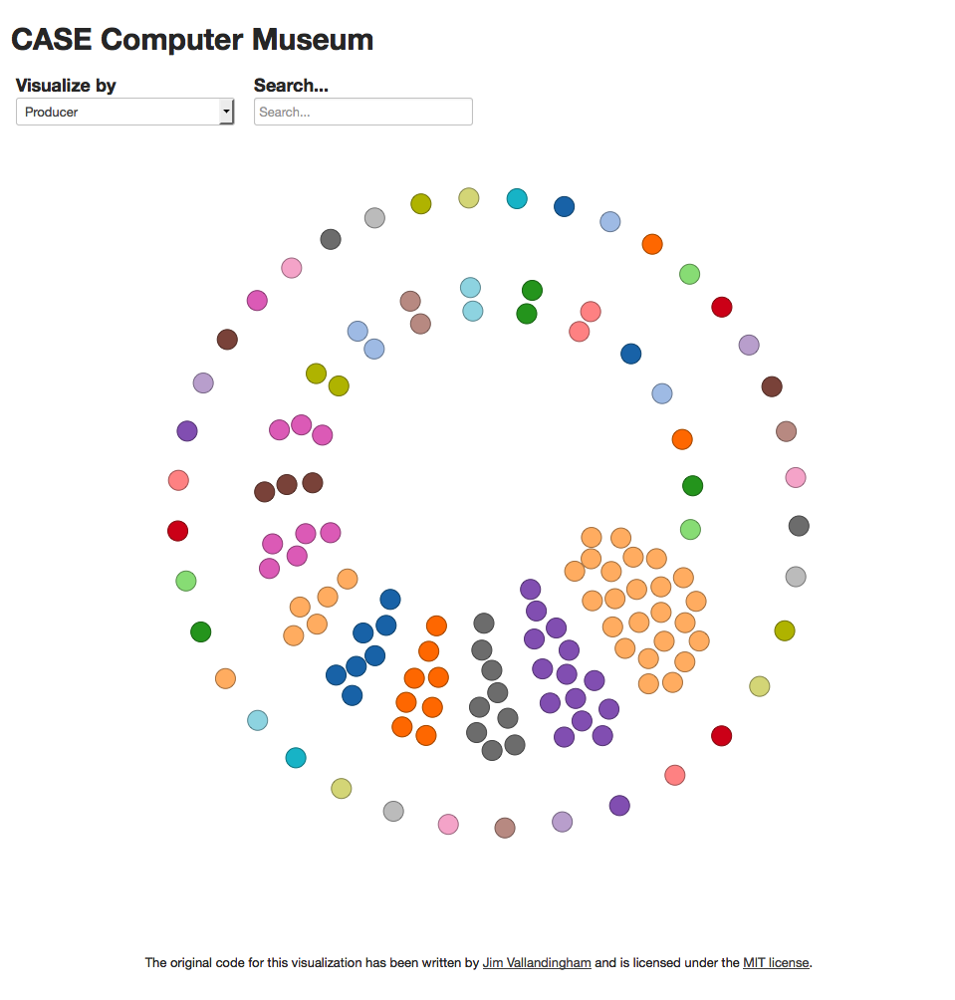

##  *Computing Machines* 

Quantlets for the book "Computing Machines" by Torsten van den Berg, Elisabeth Bommes, Wolfgang Karl Härdle and Alla Petukhina.

Data sources:
- http://ns1758.ca/winch/winchest.html
- http://www.mkomo.com/cost-per-gigabyte-update
- http://www.intel.com/pressroom/kits/quickreffam.htm

License if not stated otherwise: CC BY-NC-SA 3.0

[Live example](http://cm.wiwi.hu-berlin.de/viz)

